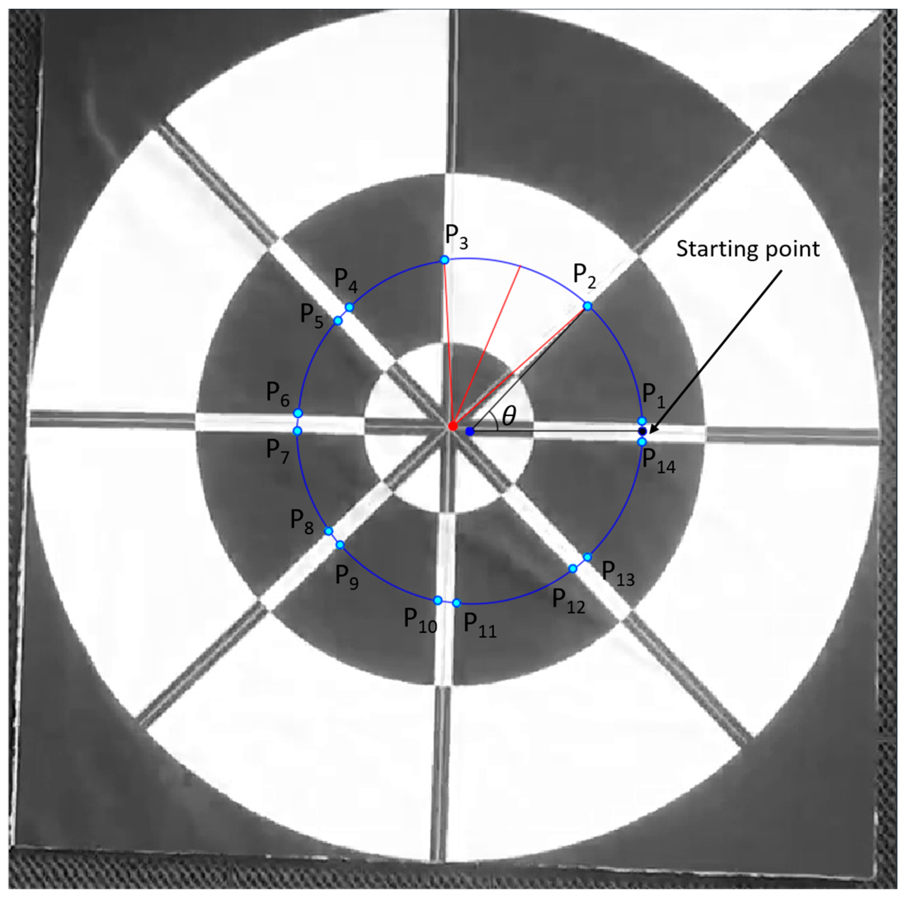

Unmanned aerial vehicles (UAVs), which are commonly known as drones, have proved to be useful not only on the battlefields where manned flight is considered too risky or difficult, but also in everyday life purposes such as surveillance, monitoring, rescue, unmanned cargo, aerial video, and photography. More advanced drones make use of global positioning system (GPS) receivers during the navigation and control loop which allows for smart GPS features of drone navigation. However, there are problems if the drones operate in heterogeneous areas with no GPS signal, so it is important to perform research into the development of UAVs with autonomous navigation and landing guidance using computer vision. In this research, we determined how to safely land a drone in the absence of GPS signals using our remote maker-based tracking algorithm based on the visible light camera sensor. The proposed method uses a unique marker designed as a tracking target during landing procedures. Experimental results show that our method significantly outperforms state-of-the-art object trackers in terms of both accuracy and processing time, and we perform test on an embedded system in various environments

[paper](https://www.mdpi.com/1424-8220/17/9/1987)

Proposed marker design: 

