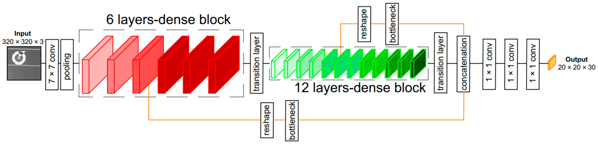
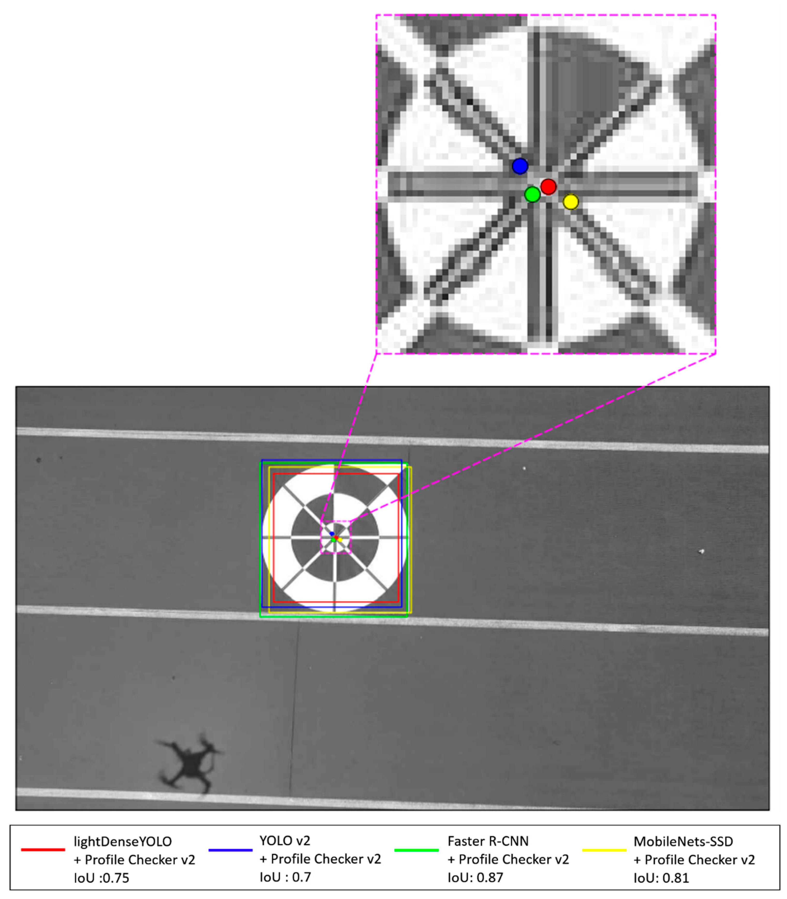
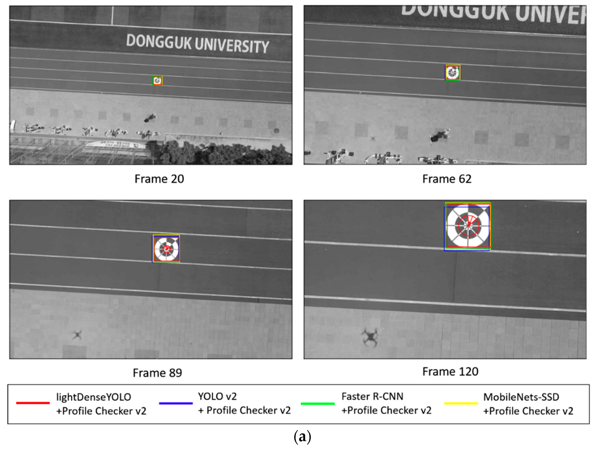

### Abstract:
Autonomous landing of an unmanned aerial vehicle or a drone is a challenging problem for the robotics research community. Previous researchers have attempted to solve this problem by combining multiple sensors such as global positioning system (GPS) receivers, inertial measurement unit, and multiple camera systems. Although these approaches successfully estimate an unmanned aerial vehicle location during landing, many calibration processes are required to achieve good detection accuracy. In addition, cases where drones operate in heterogeneous areas with no GPS signal should be considered. To overcome these problems, we determined how to safely land a drone in a GPS-denied environment using our remote-marker-based tracking algorithm based on a single visible-light-camera sensor. Instead of using hand-crafted features, our algorithm includes a convolutional neural network named lightDenseYOLO to extract trained features from an input image to predict a marker’s location by visible light camera sensor on drone. Experimental results show that our method significantly outperforms state-of-the-art object trackers both using and not using convolutional neural network in terms of both accuracy and processing time.

### lightDenseNet: 

### Comparing with SOTA object detectors

### More qualitative results

