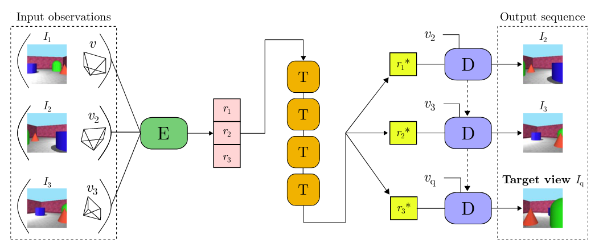
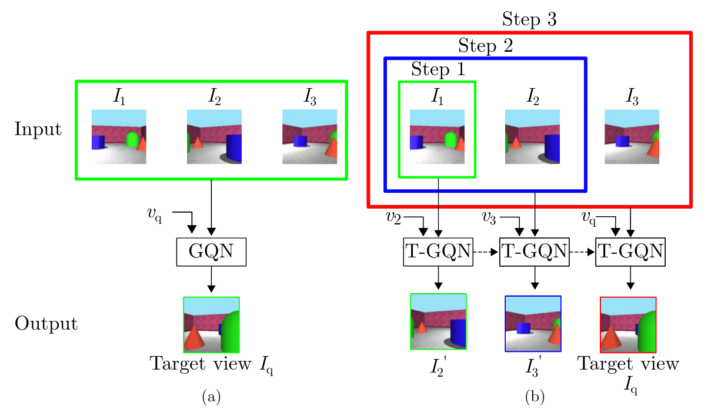
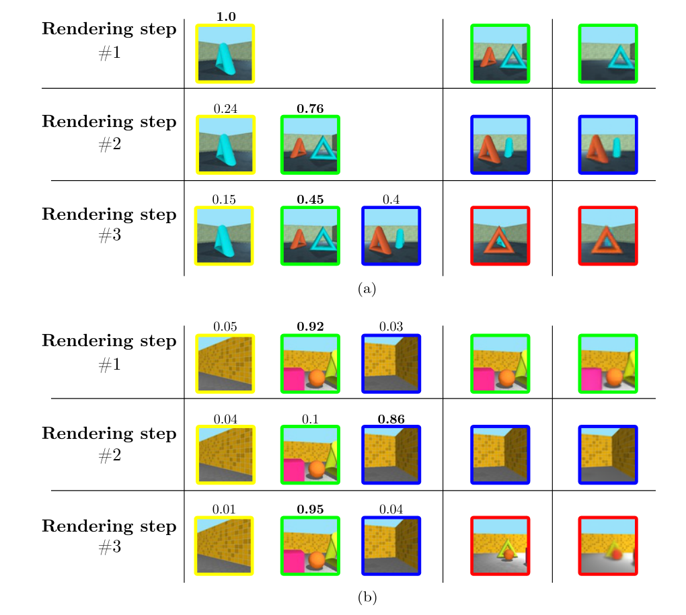
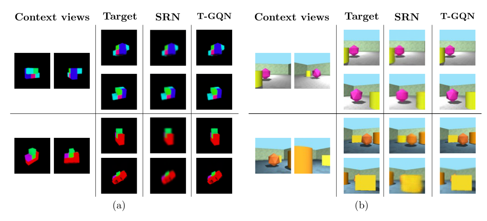
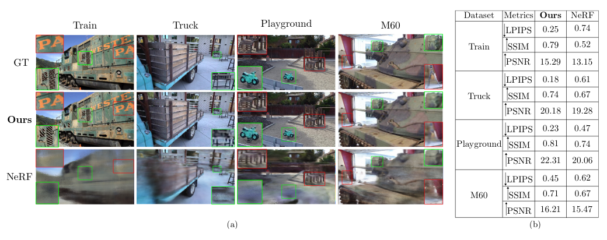

### Abstract:

 
The problem of predicting a novel view of the scene using an arbitrary number of observations is a challenging problem for computers as well as for humans. This paper introduces the Generative Adversarial Query Network (GAQN), a general learning framework for novel view synthesis that combines Generative Query Network (GQN) and Generative Adversarial Networks (GANs). The conventional GQN encodes input views into a latent representation that is used to generate a new view through a recurrent variational decoder. The proposed GAQN builds on this work by adding two novel aspects: First, we extend the current GQN architecture with an adversarial loss function for improving the visual quality and convergence speed. Second, we introduce a feature-matching loss function for stabilizing the training procedure. The experiments demonstrate that GAQN is able to produce high-quality results and faster convergence compared to the conventional approach. 

[[Download]](https://openaccess.thecvf.com/content/ACCV2020/html/Nguyen-Ha_Sequential_View_Synthesis_with_Transformer_ACCV_2020_paper.html)

### Overview of T-GQN: 

### Sequential view synthesis

### Multi-view attention learning 

### Visualization of multi-view attention score 

### Qualitative results 

