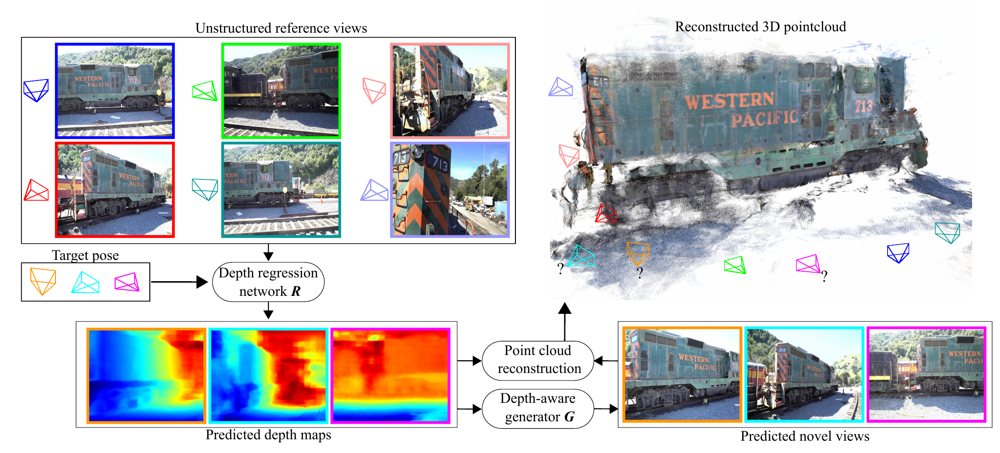
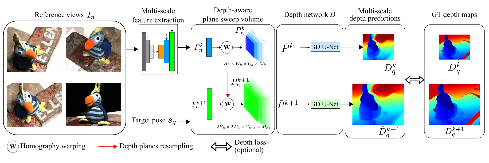
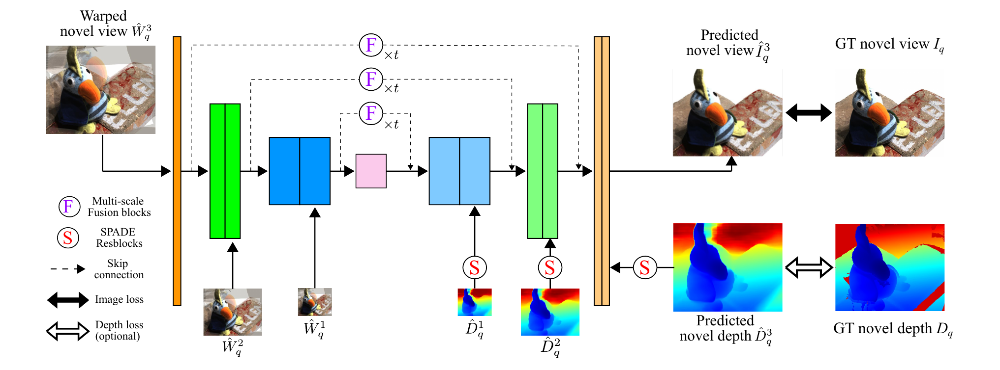
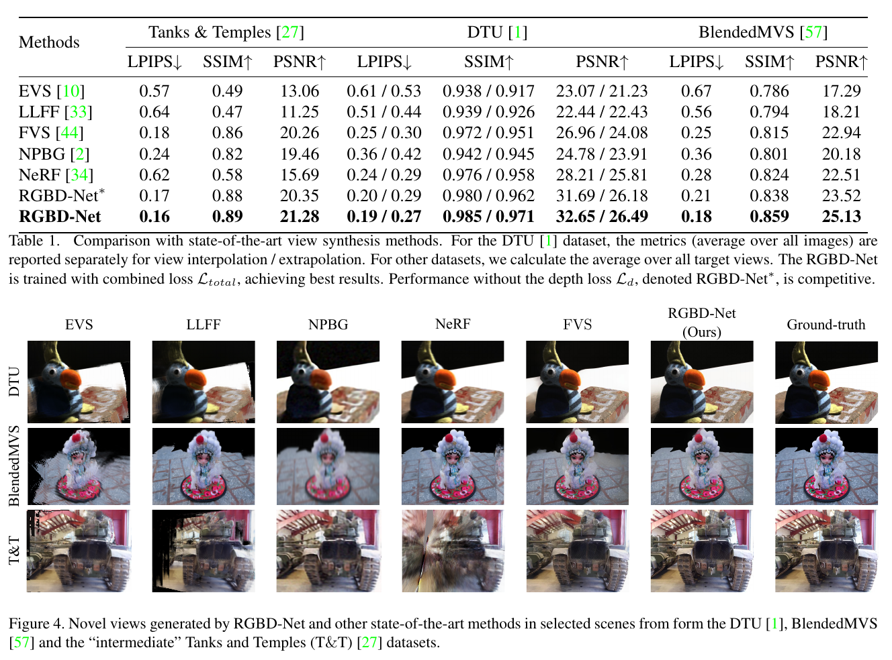
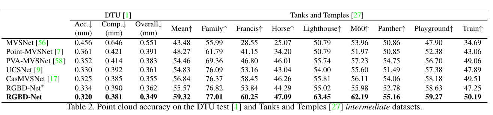
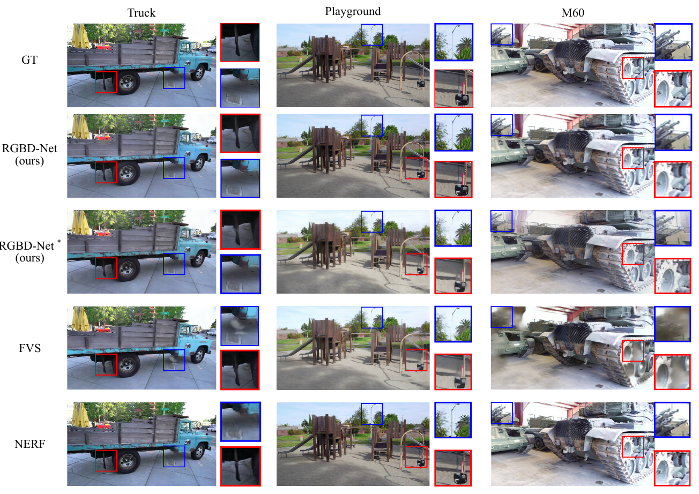
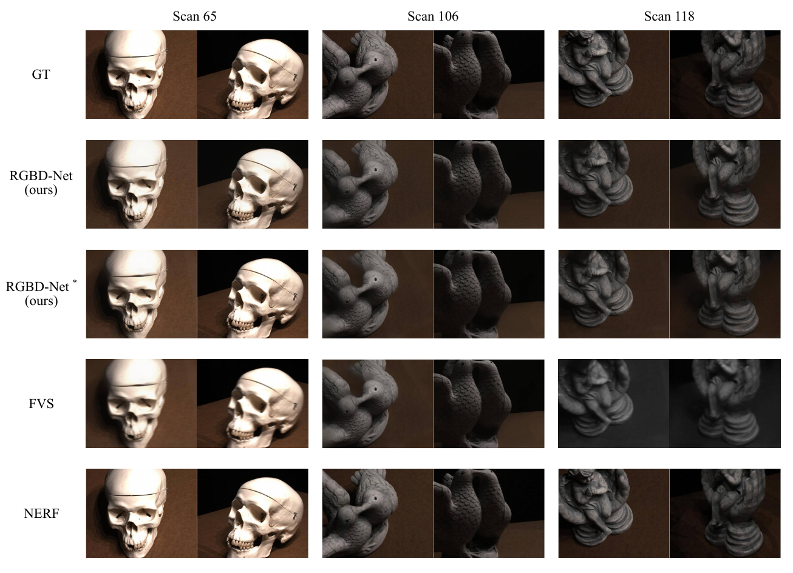
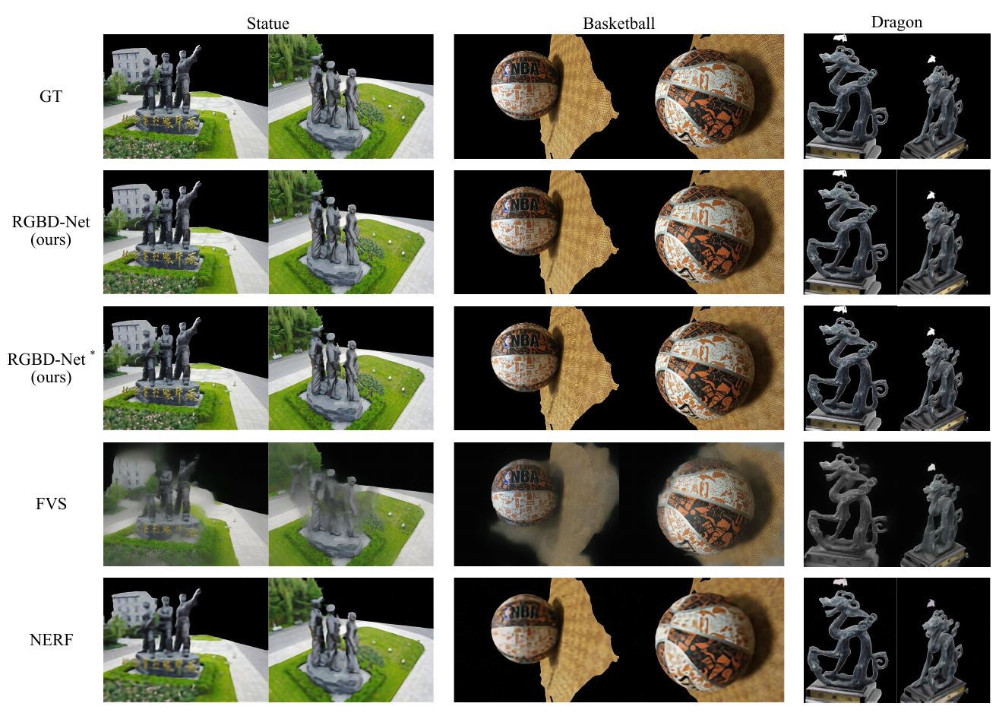
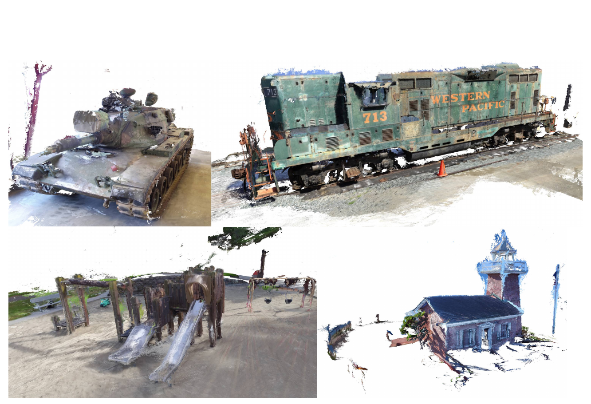
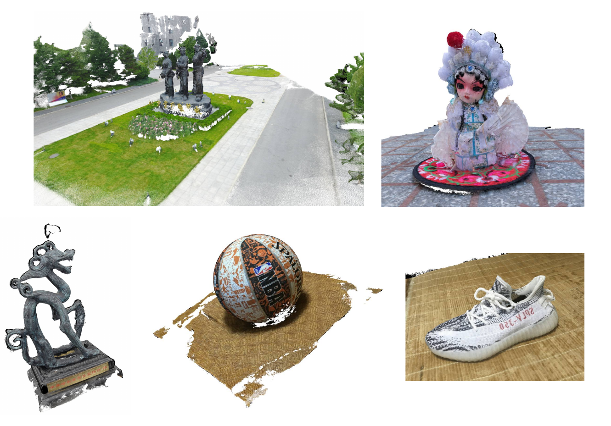

### Abstract:

 We address the problem of novel view synthesis from an unstructured set of reference images. A new method called RGBD-Net is proposed to predict the depth map and the color images at the target pose in a multi-scale manner. The reference views are warped to the target pose to obtain multi-scale plane sweep volumes, which are then passed to our first module, a hierarchical depth regression network which predicts the depth map of the novel view. Second, a depth-aware generator network refines the warped novel views and renders the final target image. These two networks can be trained with or without depth supervision. In experimental evaluation, RGBD-Net not only produces novel views with higher quality than the previous state-of-the-art methods, but also the obtained depth maps enable reconstruction of more accurate 3D point clouds than the existing multi-view stereo methods. The results indicate that RGBD-Net generalizes well to previously unseen data. 

[[Download]](https://arxiv.org/abs/2011.14398)

### Overview of RGBD-Net: 

### NovelDepth network:

### Depth-aware refinement network 

### Quantiative and Qualitative results on view synthesis 

### Qualitative results on 3D reconstruction

### More qualitative results on view synthesis 

### More qualitative results on 3D pointcloud reconstruction

